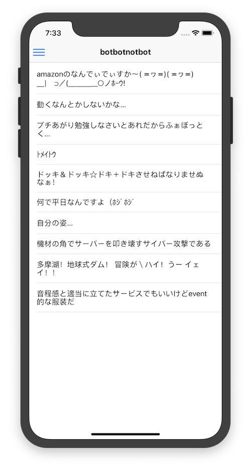
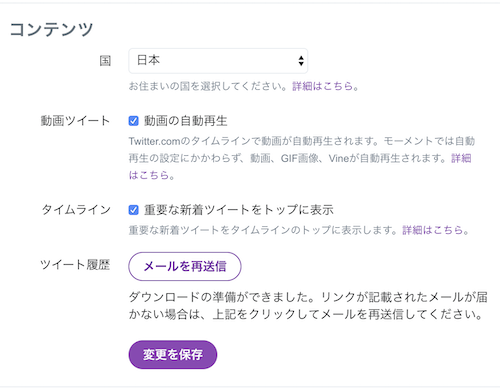
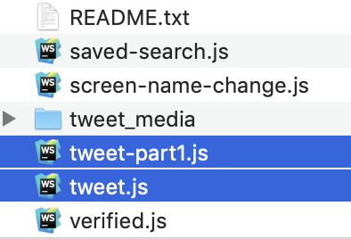

# airtoxinbotbotnotbot

手動 https://twitter.com/airtoxinbotbot

## セットアップ

[Expo](https://expo.io/) のアカウントを作成。  
(シミュレーターでのみ動作させる場合は必要ありません)  
[Expo Client](https://apps.apple.com/jp/app/expo-client/id982107779) をインストール。

`$ yarn` または `$ npm install` で依存ライブラリをインストール

Twitter の設定ページから全ツイート履歴を取得  

`$ yarn extract-tweet-text ツイートファイルパス` または  
`$ npm run extract-tweet-text ツイートファイルパス`  
のコマンドで全ツイート履歴のツイートファイルを指定します。  
複数個ファイルが有る場合はスペース区切りで一度に指定します。  
`$ yarn extract-tweet-text パス1 パス2 ...`  
  
`data` ディレクトリに作成されたモデルファイルをインターネットにアップロード (S3 や Dropbox など)

`$ cp .env{.sample,}` コマンドで env ファイルを作成。  
`.env` ファイルを編集して先程アップロードしたファイルの URL を `MODEL_FILE_URL` に指定

## 起動 (シミュレーター)

`$ yarn start` または `$ npm start`  
QR コードが表示されたら `i` を押すとシミュレーターが起動

## 起動 (実機)

`$ yarn start` または `$ npm start`  
表示された QR コードを読み取ると Expo Client で起動
